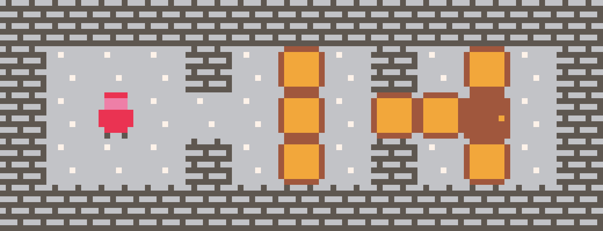
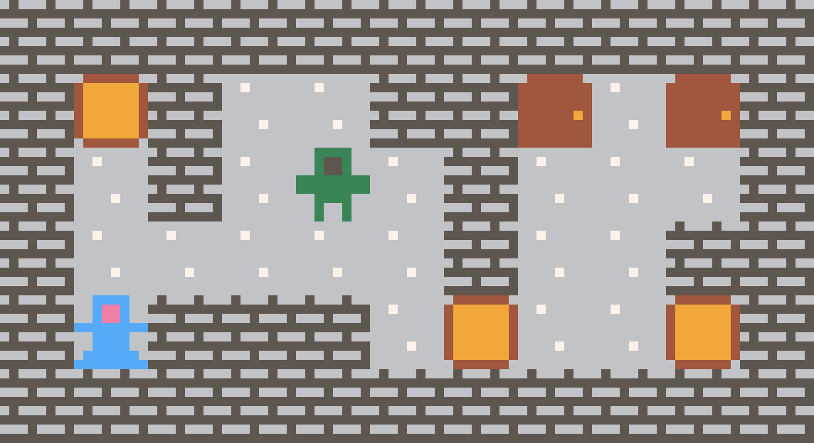

I love the game [Heroes of
Sokoban](https://sites.math.washington.edu/~ostroff/puzzles/Heroes_of_Sokoban.html)
by [Jonah Ostroff](https://sites.math.washington.edu/~ostroff). The game is the
perfect blend between simplicity and depth. The visuals of the game are minimal
but still clear, the sound effects are simple but engaging, and the puzzle
design is fun and challenging.

## "Tiny" Games

After watching a video by a YouTuber named [Juniper
Dev](https://www.youtube.com/@JuniperDev) titled [Make Tiny
Games](https://youtu.be/YtylfQq2JII), I was inspired to try recreating Jonah's
game using the Pico-8[^1]. The Pico-8 is the perfect way to learn how to create
games that are fun without getting overloaded by the complexity of making a
full game. Even just spending a couple hours is enough to create something
unique. It has everything you might need to create a full game including
writing code, drawing art, making music, and designing levels. I learned how to
use the Pico-8 in just a day, watching a few YouTube tutorials and reading a
few blog posts on how to get started. After that, I was ready to attempt my
goal of recreating _Heroes of Sokoban_.

I have some experience making small puzzle games, but I have to say this game
was super fun to try to recreate. The process of switching between my version of
the game and Jonah's and seeing what feature I had to try to implement next was
a great learning experience. I wasn't sitting at the computer completely unsure
of what to add next, I could just look at the problem that I needed to solve
and work towards a solution.

## Debuggers... or a lack thereof

I will say, there were a few times when I really wished I had a debugger. The
Pico-8 is great _because_ it's so simple, but sometimes simplicity has a cost.
I ended up resorting to using the built-in
[printh](https://www.lexaloffle.com/dl/docs/pico-8_manual.html#PRINTH)
function, which could print text to a file as the game was running. Not exactly
the most delightful debugging experience!

I come from a low-level systems programming backend, and I love diving deep
into everything that goes on in my program. As a result, I am very comfortable
stepping through code in a debugger and watching how my program runs. [Ryan
Fleury](https://www.rfleury.com), a developer from RAD Game Tools, has been
working on [The RAD Debugger](https://github.com/EpicGamesExt/raddebugger), and
it's clear he he understands the core idea that in order for a debugger to be
useful, it has to be faster than adding print statements to your code and
rerunning it to view the output, which is exactly what I had to do many, many
times while working on the Sokoban game.

## The Value of Constraints

I will say, the overall experience using Pico-8 was very charming. People
praise it _because_ it has constraints, which aren't always necessarily a bad
thing. Oftentimes constraints can actually lead to more freedom. Instead of
sitting in front of your computer with an endless stream of ideas running
through your brain and not knowing where to start or how to proceeded on a
project, constraints narrow the possibilities to just a few clear options,
making it easier to pick a direction and start creating.

I may write another blog post about some of the algorithms I came up with for
implementing sokoban, as there were some tricky cases that had to be handled.

One example of this is the fact that the game supports multiple characters that
you can switch between, each with different rules for how they move and
interact with blocks.

## Wrapping Up

That brings us to the end of this post! As always, if you have any questions,
please feel free to reach out. If you want to play my version of the sokoban
game, it's hosted as a web version on my website [here](/games/heroes.html/).
If you want to play the original _Heroes of Sokoban_ games (which I strongly
recommended you do!), you can find the links on Jonah Ostroff's
[website](https://sites.math.washington.edu/~ostroff/puzzles.html).

[^1]: If you're unfamiliar with the Pico-8, it's essentially a "fantasy
  console". It's built for people who love retro games or just value
  simplicity. It's honestly a really great way to get into game programming.  I
  recommend you check out their website, and maybe play a few games other
  people have made using it: https://www.lexaloffle.com/pico-8.php
