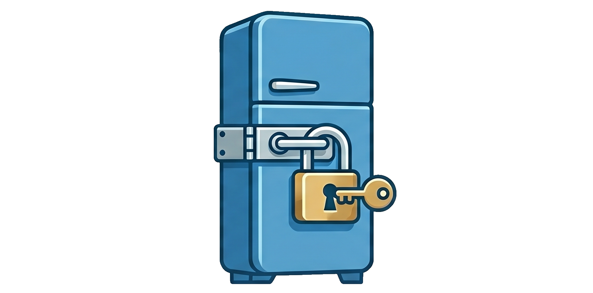

Recently, I upgraded my homelab setup.

While doing so, I was frustrated with the amount of usernames and passwords I
had to create for every single app I wanted to use. So, I came up with the
"Refrigerator Policy."

The idea is that you wouldn't bother putting a passcode on your refrigerator,
because you already have a lock on your front door. If someone got into your
house, would stopping them from eating your leftovers be your biggest concern?

If someone gets access to my home network, I don't care that they can watch my
movies, because they can do damage in a lot worse ways. The focus should be on
securing your entire network, not individual apps and processes.

*(This is [mostly] a joke I made in front of a few of my friends who are
cybersecurity analysts to ragebait them.)*

